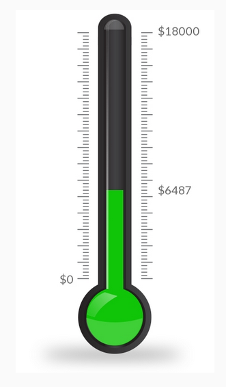

# Google Sheets Donation Thermometer

These HTML/Javascript and PHP scripts take a dollar value from a Google Sheets spreadsheet you control and turns them into a "live" thermometer to show donors how close you are to your goal. Obviously to make it truly live you'll need to ensure that donations are reflected in the spreadsheet as soon as possible, either manually or by some other method.



In order to use these scripts you'll need a web server capable of running PHP scripts, and also the ability to edit the HTML/Javascript of your website. The server running PHP should also allow you to edit server settings like 'Access-Control-Allow-Origin'.

The PHP component is required because Google's publishing feature often doesn't include adequate 'Access-Control-Allow-Origin' headers to access your spreadsheet directly via Javascript.

## License

Copyright 2020 Chimera Art Space

Licensed under the Apache License, Version 2.0 (the "License");
you may not use this file except in compliance with the License.
You may obtain a copy of the License at

    http://www.apache.org/licenses/LICENSE-2.0

Unless required by applicable law or agreed to in writing, software
distributed under the License is distributed on an "AS IS" BASIS,
WITHOUT WARRANTIES OR CONDITIONS OF ANY KIND, either express or implied.
See the License for the specific language governing permissions and
limitations under the License.

## Setup

Make a Google Sheet like this. The columns don't really matter, what matters is that the total current dollar amount you want displayed in the thermostat is being calculated in a cell we can access later. In this example we're using cell B1. Feel free to make the spreadsheet fit your needs (for example I like to also track whether we sent thank-yous or rewards in this sheet.)


| Sum:     | =SUM(B2:B) | Name     | Email            |
| -------- | ---------- | -------- | ---------------- |
|3/24/2020 | $600.00    | John Doe | john@example.com |


Make sure that cell B1 is an actual formula `=SUM(B2:B)` that adds up all the rows, you may have to edit it manually to make it a formula (no apostrophe mark before the formula). If you can't use cell B1 for your total, that's okay, just make sure that instead of typing "b1" below you type the cell number you actually want to use to be the "current value" for your thermometer.

Then go to File, Publish to the Web, and choose to Link Sheet1 as a Comma-separated values file. (Or whichever sheet has the total you want to use.)
Copy the URL (looks like https://docs.google.com/spreadsheets/d/e/2PACX-1vS...cFd-NZEj/pub?gid=0&single=true&output=csv )

## Installation

In your PHP web server, download the thermometer-proxy.php file to a web-accessible location of your choosing. Edit the file and paste your Google URL into the file, replacing `YOUR_GOOGLE_URL_HERE` where it says `$path = "YOUR_GOOGLE_URL_HERE";` .

Look carefully at the Google URL you just pasted. The last part should say something like `?gid=0&single=true&output=csv` however you need to add the text `&range=b1` onto the end so it looks like `?gid=0&single=true&output=csv&range=b1` instead. This makes our job easier by only giving us the total number without having to parse the whole sheet.

Make sure you can access the thermometer-proxy.php file from the internet, by going to its public address i.e. `http://your-website.example.com/thermometer-proxy.php` . You should see the contents of cell B1 from your spreadsheet, like `"$123.45"` . Copy this URL for the next step.

On your website, copy the contents of the thermometer.html file into the part of your website where you want it to appear. (Can be a custom code block in Squarespace, custom HTML inside Wordpress, part of a template, etc.) Paste the proxy URL from the previous step, replacing YOUR_PROXY_URL_HERE where it says `var sheetPublicWebUrl = "YOUR_PROXY_URL_HERE";` . Also adjust `var maxValue = 10000;` to whatever number you want to be the maximum amount for your thermometer (usually your fundraising or donation goal.)

## Testing

Look at your website and see if the thermometer appears as expected. If it's totally blank, try looking at your browser's Javascript Console to see what the error is. For example you may need to set your PHP webserver to specify permissive Access-Control-Allow-Origin headers (which is the thing that Google's not doing which requires us to have a proxy in the first place. Good news, we usually have more control over our own webserver than over Google.)

If you are seeing Access-Control-Allow-Origin errors, and your webserver is Apache, try creating a file called .htaccess right next to the thermometer-proxy.php file with the following contents:

```
<IfModule mod_headers.c>
    Header set Access-Control-Allow-Origin "*"
</IfModule>
```

Note we've already tried to specify this setting in our PHP file, so if neither of these work it could be something set on the server itself causing the problem.
